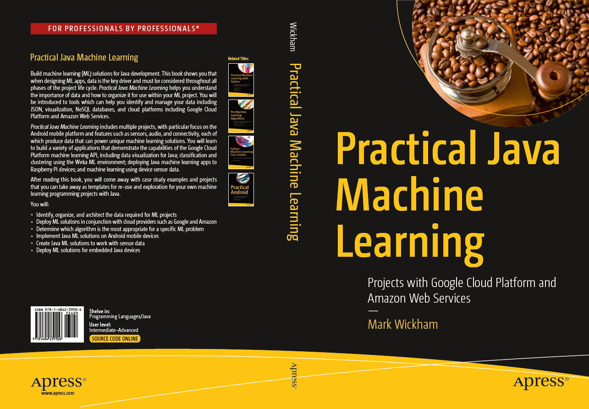

# Practical-Java-ML
#### by: Mark Wickham

### https://www.apress.com/us/book/9781484239506

# About the Book
This new book by author Mark Wickham explores Machine Learning with a goal to help develpers leverage recent advances in this subfield of artificial intelligence, and deploy thier own machine learning solutions "at the edge". The "edge" refers to the ubiquitous devices we have with us all the time, such as mobile phones, or small embedded devices which collect much of todays increasingly important sensor data. The book will focus on the Java programming language and provide complete projects to help developers deploy machine learning solutions to these devices.  

# What You'll Learn
* Introduce readers to the exciting developments in the AI subfield of Machine Learning (ML). 
* The book will summarize the types of problems machine learning can solve.
* Help readers understand the importance of data as the critical input for any machine learning solution. How to Identify, organize, and architect the data required for ML. 
* Strategies and techniques for the visualization and pre-processing of data will also be covered using available Java packages. 
* The book will help readers who know Java to become more proficient in data science.
* The book will explore how we can deploy ML solutions in conjunction with cloud service providers such as Google and Amazon.
* The book will focus exclusively on Java libraries and Java-based solutions for ML. The book will NOT cover other popular ML languages such as Python or C++. 
* The book will focus on classic machine learning solutions and will not cover implementations for deep learning which use neural networks. Deep learning is a topic that requires a complete text of its own for proper exploration.
* Provide readers a complete overview of ML algorithms. Rather than cover these algorithms from a mathematical viewpoint, the book will present a practical review of the algorithms and explain to readers which algorithm to select for particular problems.
* Introduce readers to the most important Java-based ML platforms. The book will provide a deep dive into the popular Weka Java environments. The book will show readers how to port the latest Weka version to Android.
* Java developers have the advantage of easily transitioning to the Android Mobile platform. The book will show readers how to deploy ML apps for Android devices using the Weka API.
* One of the fastest growing sources of data is sensor data. Embedded devices often produce sensor data, enabling a significant opportunity to deploy ML solutions for these devices. The book will show readers how to implement ML solutions for sensor data using Java.

# Project-Based approach
The book uses a **_project-based approach_**. Unlike most books on the market today, The book provides **_complete working code_** for all of the projects.
* **_D3 Visualization_** - This project will demonstrate how to produce data visualizations on the Desktop Browser using the D3 Javascript library.
* **_Data Visualization_** - Android app loads data and displays a visualization of the data within a WebView control. The application uses the D3 Javascript library, and demonstrates several useful visualizations for machine learning.
* **_Google Cloud Platform Cloud Speech API_** -.This Android application demonstrates access to deep learning functionality through a publicly available API.
* **_Weka Android Port_** - This Eclipse project ports Weka version (stable 3.8.1) to Android, creating the Android-Weka-3-8-1.jar file. Android apps can then use the Weka API for loading, classifying, and clustering applications.
* **_Android Model Creation_** - This Android project will demonstrate how to load data files into Android, and create a model for classification.
* **_Android Model Loading_** - This Android project will demonstrate how to load a pre-trained model into Android. The model can classify samples. The app includes time stamping for model performance evaluation.
* **_Raspberry Pi Old Faithful_** - This clustering project will use the Old Faithful geyser dataset and a Weka clustering model created in the book to implement a clustering application for Old Faithful on the Raspberry Pi device.
* **_Android Activity Tracker_** - This large-scale classification project will use the PAMAP2_Dataset classification model from the book to implement an Android Activity Tracking app.

# Who This Book Is For
* Developers looking to implement ML solutions for Java platforms.
* Data Scientists looking to explore Java implementation options.
* Business decision makers looking to explore entry into machine learning for their organizations.

The book will be of most value to experienced Java developers who have not implemented ML techniques before. The book will help explain the various ML techniques that are now feasible due to recent advances in performance, storage, and algorithms. 
The book will explain how these new techniques allow developers to achieve interesting new functionality that was not previously possible with traditional development approaches.

### https://www.apress.com/us/book/9781484239506

# About the Author
Mark Wickham is a frequent speaker at Android developer conferences and has written two books, Practical Android and Practical Java Machine Learning. As a a freelance Android developer, Mark currently resides in Dallas, TX after residing in China for most of the past 20 years. While at Motorola, Mark led product management, product marketing, and software development teams in the Asia Pacific region. Mark has a degree in Computer Science and Physics from Creighton University, and MBA from the University of Washington and studied at the Hong Kong University of Science and Technology. Mark is also active as a freelance video producer, photographer, and enjoys recording live music.
